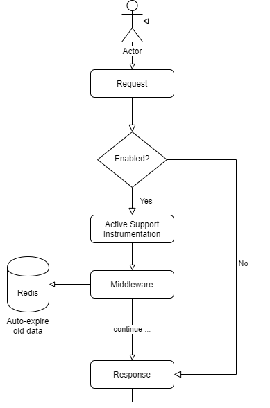

# Rails Performance

[](https://travis-ci.org/igorkasyanchuk/rails_performance)
[](https://www.railsjazz.com)

A self-hosted tool to monitor the performance of your Ruby on Rails application.

This is **simple and free alternative** to the New Relic APM, Datadog or other similar services.


It allows you to track:

- throughput report (see amount of RPM (requests per minute))
- an average response time
- the slowest controllers & actions
- total duration of time spent per request, views rendering, DB
- SQL queries, rendering logs in "Recent Requests" section
- simple 500-crashes reports
- track Sidekiq jobs performance
- works with Rails 4.2+ (and probably 4.1, 4.0 too) and Ruby 2.2+

All data are stored in `local` Redis and not sent to any 3rd party servers.

## Production

Gem is production-ready. At least on my 2 applications with ~800 unique users per day it works perfectly. 

Just don't forget to protect performance dashboard with http basic auth or check of current_user.

## Usage

```
1. Add gem to the Gemfile (in appropriate group if needed)
2. Start rails server
3. Make a few requests to your app
4. open localhost:3000/rails/performance
5. Tune the configuration and deploy to production
```

Default configulation is listed below. But you can overide it.

Create `config/initializers/rails_performance.rb` in your app:

```ruby
RailsPerformance.setup do |config|
  config.redis    = Redis::Namespace.new("#{Rails.env}-rails-performance", redis: Redis.new)
  config.duration = 4.hours

  config.debug    = false # currently not used>
  config.enabled  = true

  # default path where to mount gem
  config.mount_at = '/rails/performance'

  # protect your Performance Dashboard with HTTP BASIC password
  config.http_basic_authentication_enabled   = false
  config.http_basic_authentication_user_name = 'rails_performance'
  config.http_basic_authentication_password  = 'password12'

  # if you need an additional rules to check user permissions
  config.verify_access_proc = proc { |controller| true }
  # for example when you have `current_user`
  # config.verify_access_proc = proc { |controller| controller.current_user && controller.current_user.admin? }
end if defined?(RailsPerformance)
```

## Installation
Add this line to your application's Gemfile:

```ruby
gem 'rails_performance'

# or

group :development, :production do
  gem 'rails_performance'
end
```

And then execute:
```bash
$ bundle
```

You must also have installed Redis server, because this gem is storing data into it.

After installation and configuration, start your Rails application, make a few requests, and open `https://localhost:3000/rails/performance` URL.

## How it works



## Limitations

- it doesn't track params of POST/PUT requests
- it doesn't track Redis/ElasticSearch or other apps
- it can't compare historical data
- depending on your load you may need to reduce time of for how long you store data, because all calculations are done in memory and it could take some time for high-load apps

## Redis

Gem is using Redis. This is the only one dependency.

All information is stored into Redis. The default expiration time is set to `config.duration` from the configuration.

## Development & Testing

Just clone the repo, setup dummy app (`rails db:migrate`).

After this:

- rails s
- rake test

Like a regular web development.

Please note that to simplify integration with other apps all CSS/JS are bundled inside, and delivered in body of the request. This is to avoid integration with assets pipeline or webpacker.

For UI changes you need to use Bulma CSS (https://bulma.io/documentation).

## Why

The idea of this gem grew from curriosity how many RPM my app receiving per day. Later it evolutionated to something more powerful.

## TODO

- documentation in Readme
- capture stacktrace of 500 errors and show in side panel
- generator for initial config
- CI for tests
- time/zone config?
- connected charts on dashboard, when zoom, when hover?
- ability to zoom to see requests withing specific datetime range
- better hints?
- export to csv
- better stats tooltip, do not show if nothing to show
- dark mode toggle? save to the cookies?
- integration with elastic search? or other?
- monitor active job (sidekiq)?
- better logo?
- number of requests last 24 hours, hour, etc.
- collect deprecation.rails
- fix misspellings?
- show "loading banner" until jquery is loaded?
- better UI on smaller screens? Recent requests when URL's are long? Truncate with CSS?
- rules for highlighting durations? how many ms to show warning, alert

## Contributing

You are welcome to contribute. I've a big list of TODO.

## Big thanks to contributors

- https://github.com/synth
- https://github.com/alagos
- https://github.com/klondaiker

## License

The gem is available as open source under the terms of the [MIT License](https://opensource.org/licenses/MIT).

[](https://www.railsjazz.com/)
